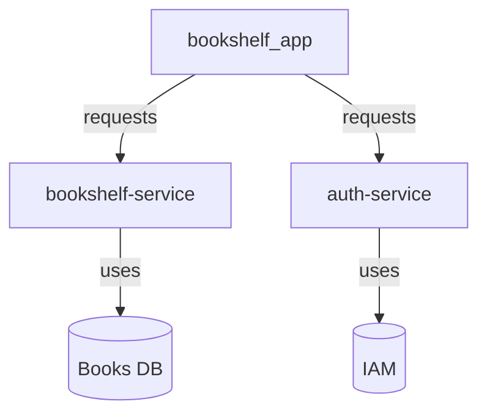

# Bookshelf Demo

A simple demo application that demonstrates how to build a distributed full-stack application with Flutter, Go and Rust.

## Architecture



The `bookshelf_app` is the client-facing Flutter application that provides a UI for users to authenticate and
manage their books. The `bookshelf-service` is a Go Microservice that provides the business logic for managing books.
The `auth-service` is a Rust Microservice that connects to IAM providers and provides user authentication.

## Quick Start

To quickly start the entire application, you can either use Docker Compose or manually start each service.

Hardcoded credentials for the `auth-service` are for development and testing purposes:

- Username: `admin`
- Password: `admin`

### Using Docker Compose

Ensure you have [Docker](https://docs.docker.com/get-docker/)
or [Podman](https://podman.io/getting-started/installation) installed, then run:

```bash
docker compose up
```

This will build and start both the `auth-service` and `bookshelf-service`. Further this configuration will build
the `bookshelf_app` Flutter application for web and run it on http://localhost:8080.

### Manual Setup

#### Prerequisites

- [Go](https://golang.org/dl/) must be installed
- [Rust](https://www.rust-lang.org/tools/install) must be installed
- [Flutter](https://flutter.dev/docs/get-started/install) must be installed

#### Running the application

1. Start the `auth-service`: `make auth`
2. Start the `bookshelf-service`: `make books`
3. Start the `bookshelf_app`: `make app`
